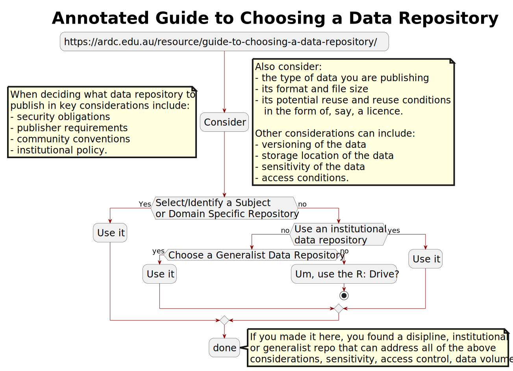
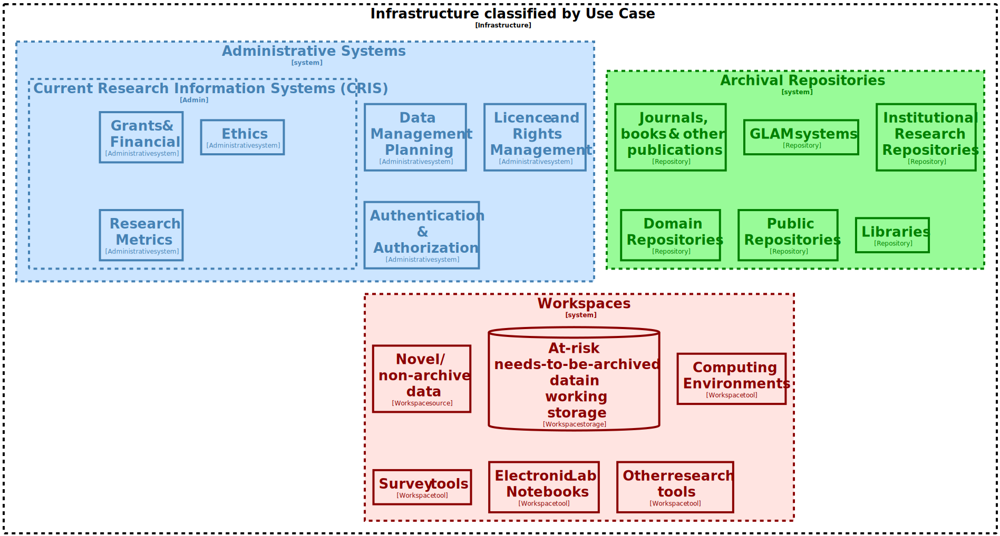
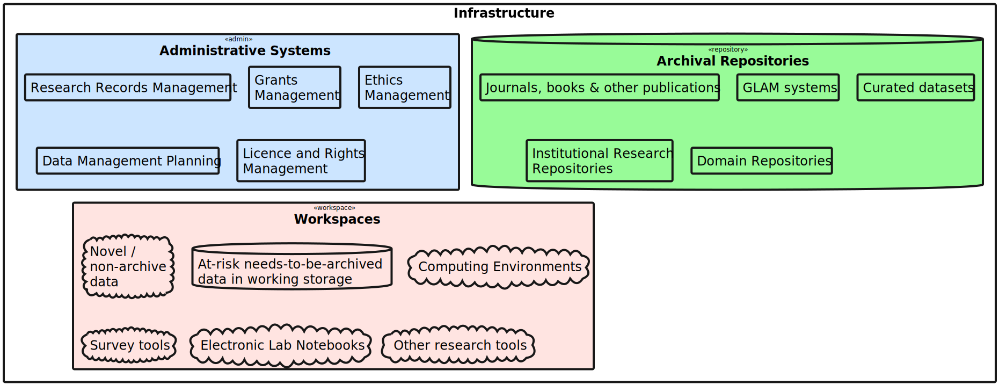
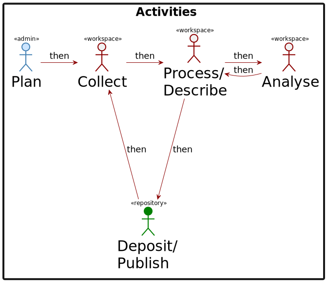
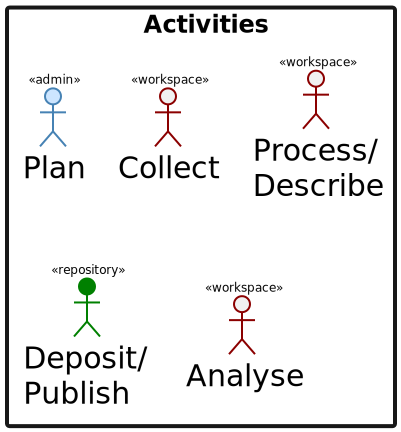
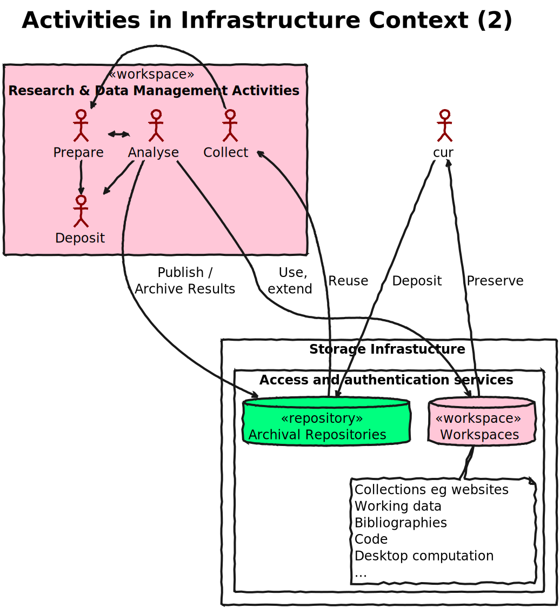
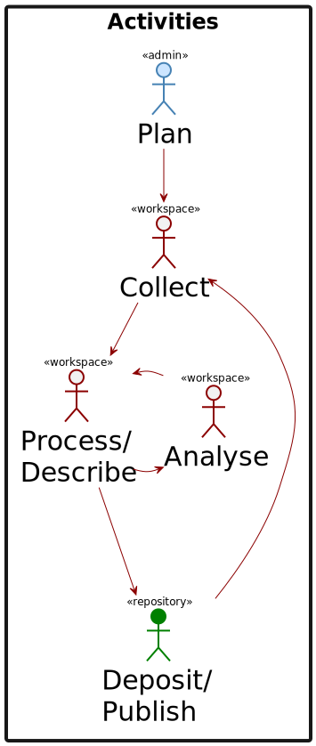

# Image summary for model-v2

## [model-v2/ardc-repo-chooser.svg](./ardc-repo-chooser.svg)

## [model-v2/infrastructure-layer.svg](./infrastructure-layer.svg)

## [model-v2/legend.svg](./legend.svg)

## [model-v2/model-activities-sequence.svg](./model-activities-sequence.svg)

## [model-v2/model-activities.svg](./model-activities.svg)

## [model-v2/model-overview.svg](./model-overview.svg)

## [model-v2/model-with-labels.svg](./model-with-labels.svg)

