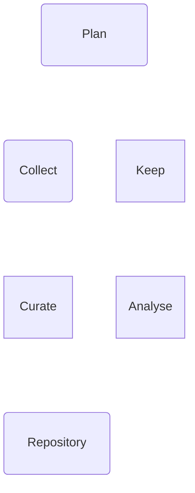
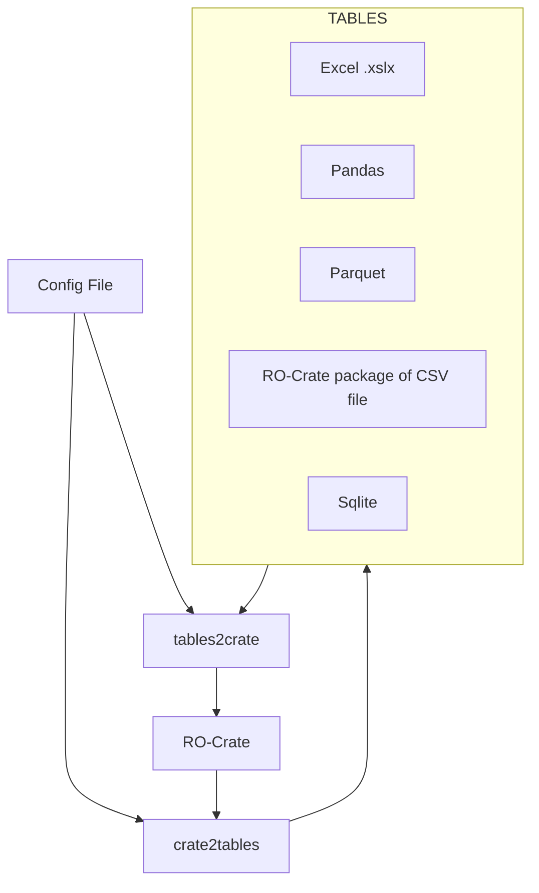
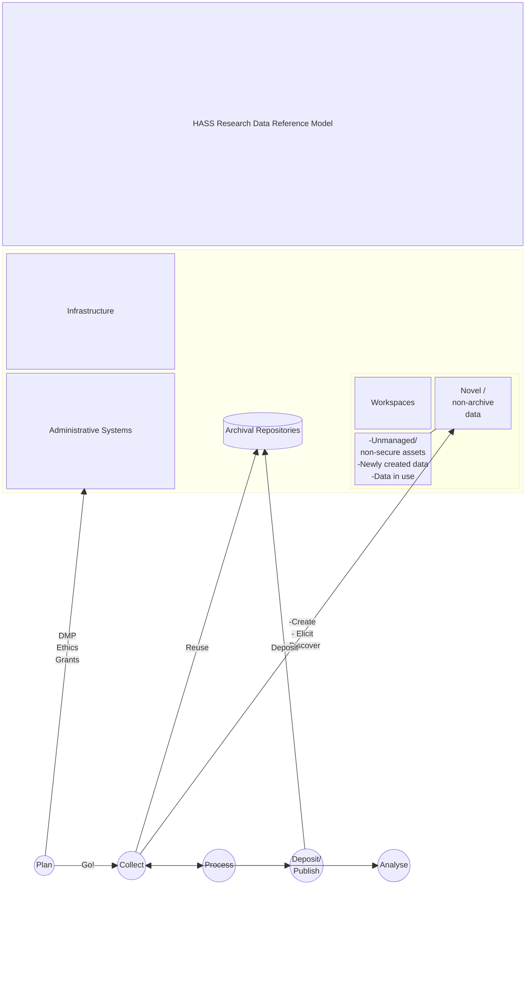

```mermaid
block-beta
  columns 6
  title["HASS Research Data Reference Model"]:6
  block:infra:6
    columns 3
    infraTitle["Infrastructure"]:3
    admin["Administrative Systems"]
    repo[("Archival Repositories")]
    block:ws
      columns 2
      wsTitle["Workspaces"]
      new["Novel /\nnon-archive\ndata"]
      noteNew["-Unmanaged/\nnon-secure assets\n-Newly created data\n-Data in use"]
    end
  end

  space:6
  plan(("Plan")) coll(("Collect")) prep(("Process")) dep(("Deposit/\nPublish")) an(("Analyse")) space

  plan -- "DMP\nEthics\nGrants" --> admin
  plan -- "Go!" --> coll
  coll --> prep
  prep --> dep
  prep --> an
  an --> coll
  coll -- "-Create\n- Elicit\n- Discover" --> new
  coll -- "Reuse" --> repo
  dep -- "Deposit" --> repo
  new --- noteNew
``````mermaid
block-beta
  columns 10
  space:2
  plan("Plan"):6
  space:2
  space:10
  col("\nCollect\n\n"):4
  space:2
  Keep:4
  space:10
  Curate:4
  space:2
  Analyse:4
  space:10
  repository("Repository"):6
 
  
  classDef dataprep fill:#add8e6,stroke:#add8e6,stroke-width:4px
  classDef repository fill:#90ee90,stroke:#90ee90,stroke-width:4px
  classDef workspace fill:#ffe4e1,stroke:#ffe4e1,stroke-width:4px
  
  %% class col,Prepare dataprep
  %% class Keep repository
  %% class Analyse workspace  
```


