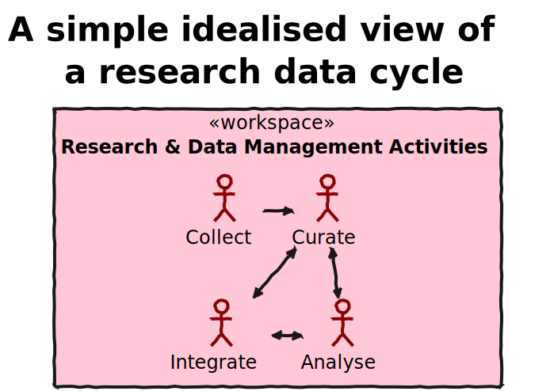
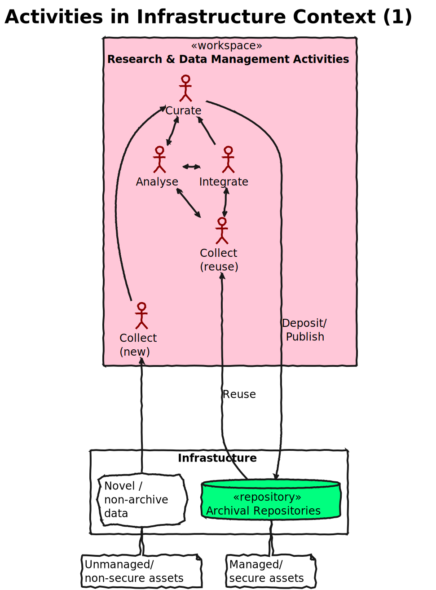
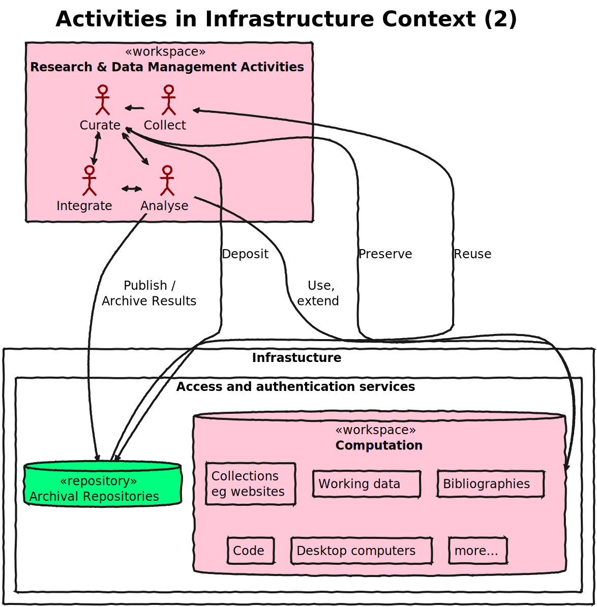
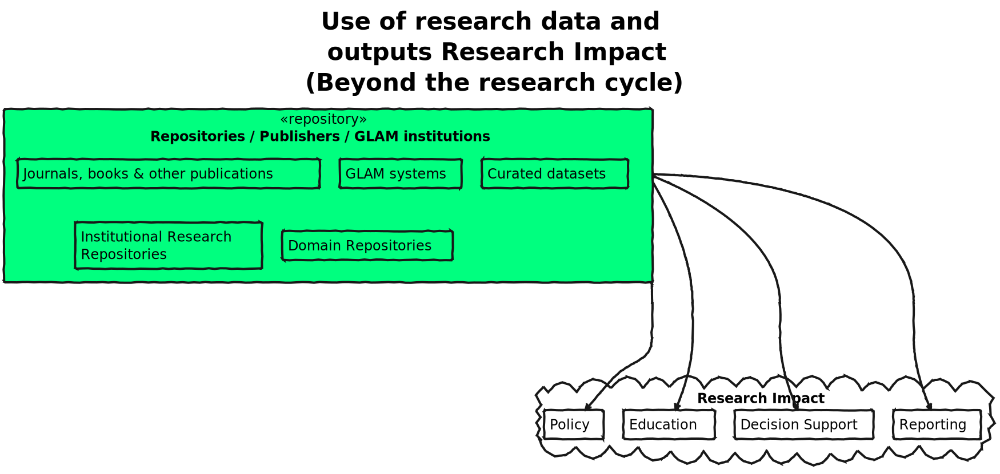
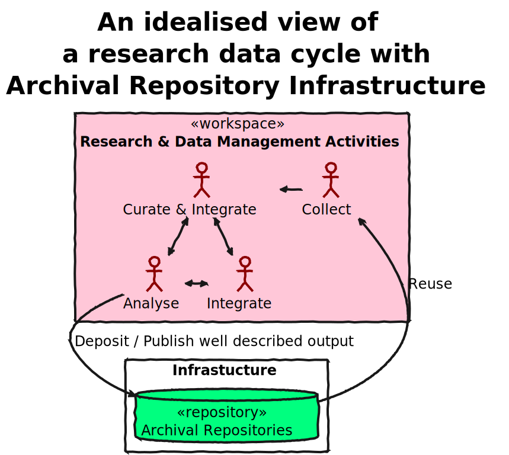
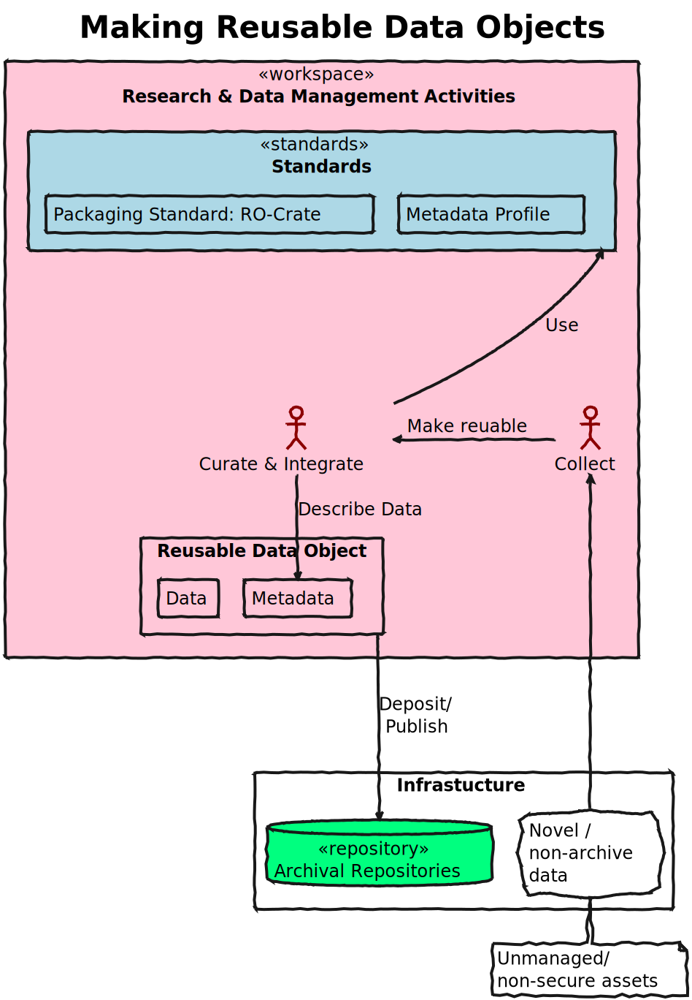
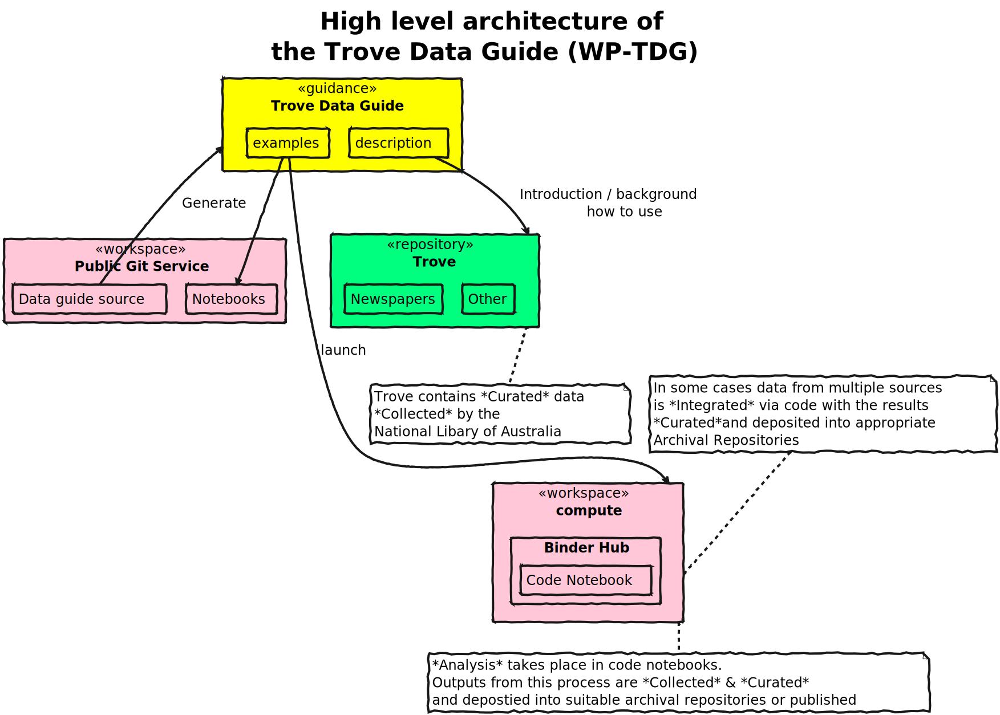

# Image summary for model

## [model/model-activities.svg](./model-activities.svg)

## [model/model-overview-1.svg](./model-overview-1.svg)

## [model/model-overview-2.svg](./model-overview-2.svg)

## [model/model-overview-3.svg](./model-overview-3.svg)

## [model/model-overview-repo-cycle.svg](./model-overview-repo-cycle.svg)

## [model/objects.svg](./objects.svg)

## [model/wp-tdg-architecture.svg](./wp-tdg-architecture.svg)

