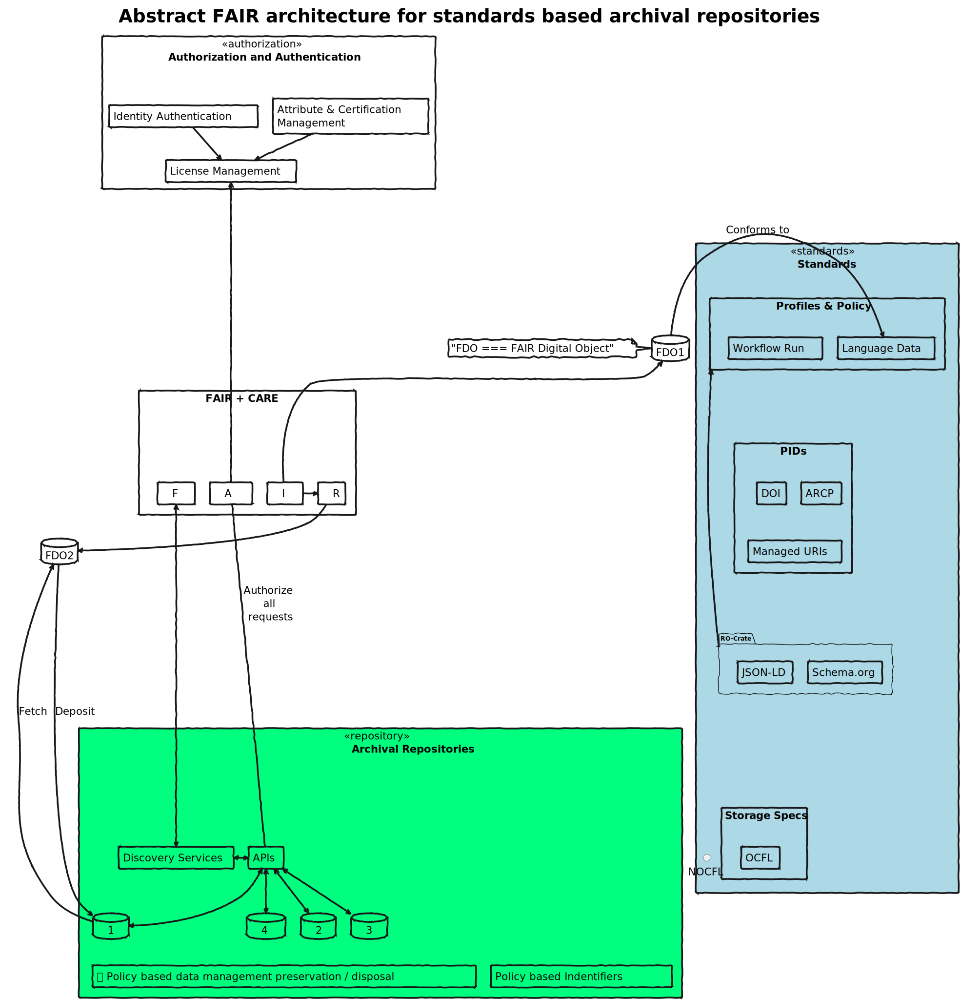
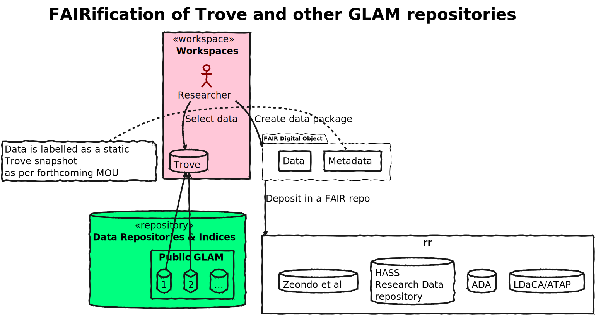
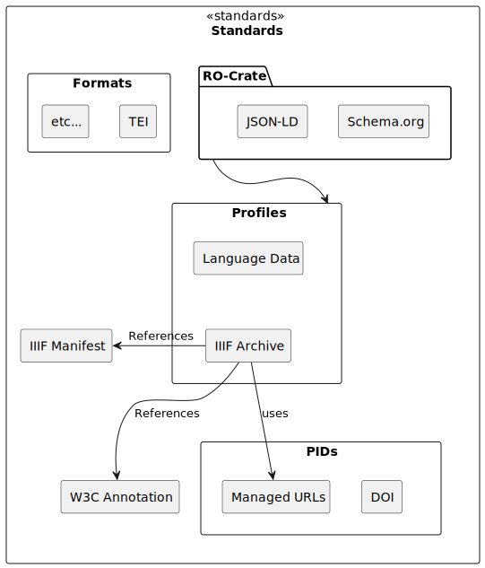
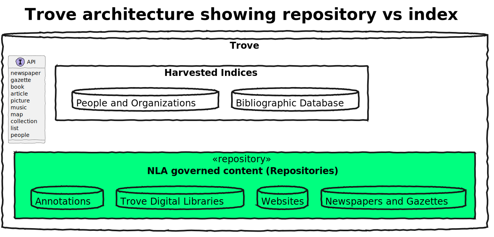
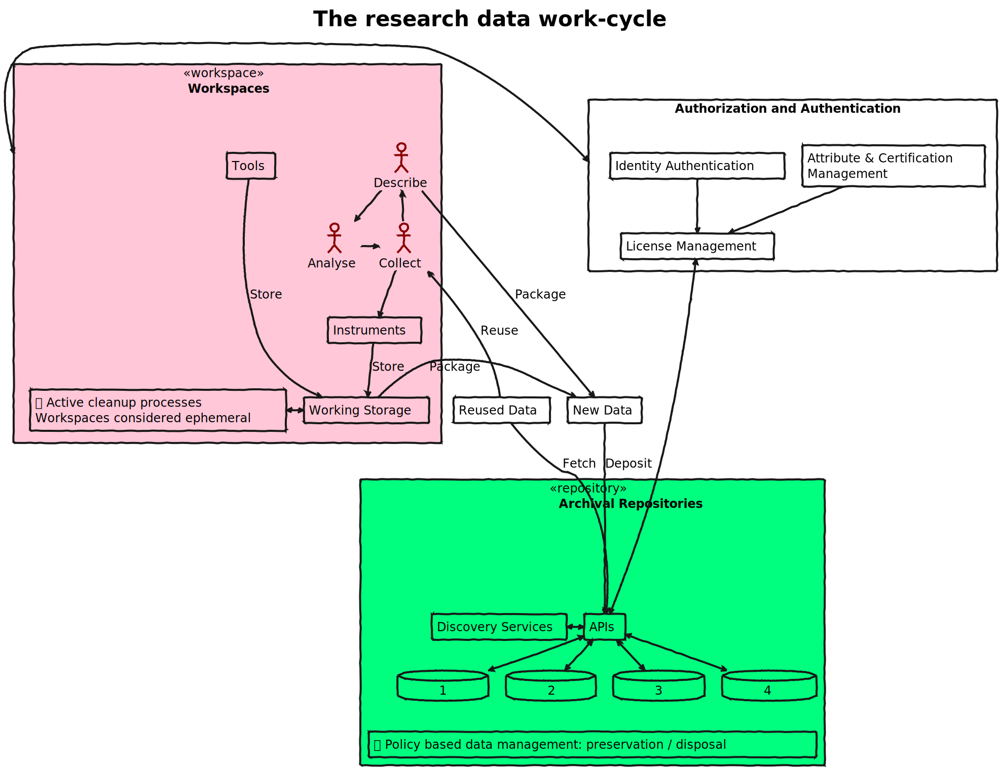
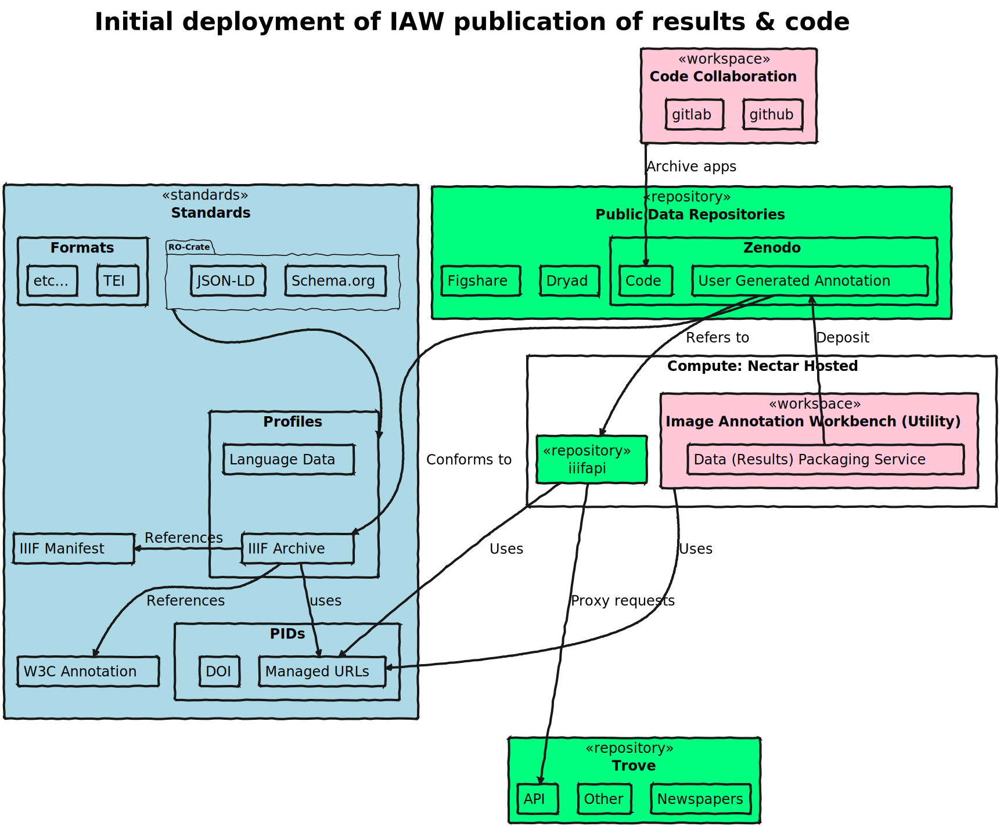
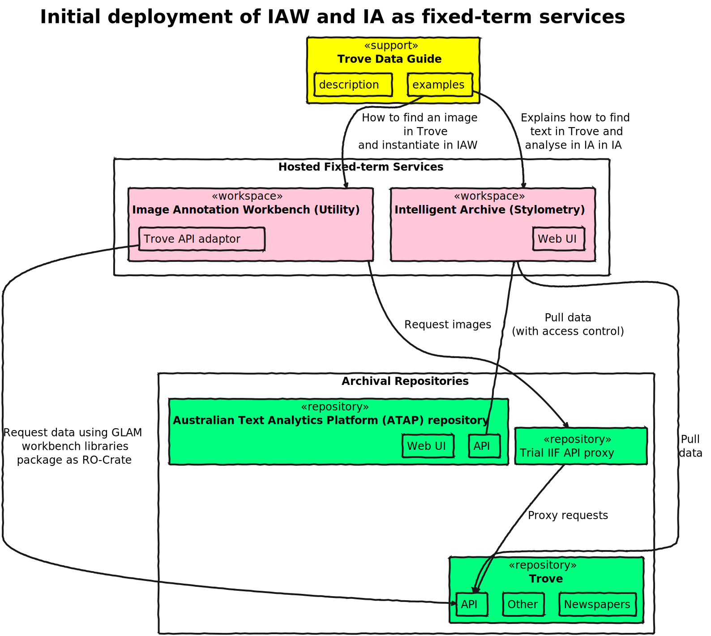
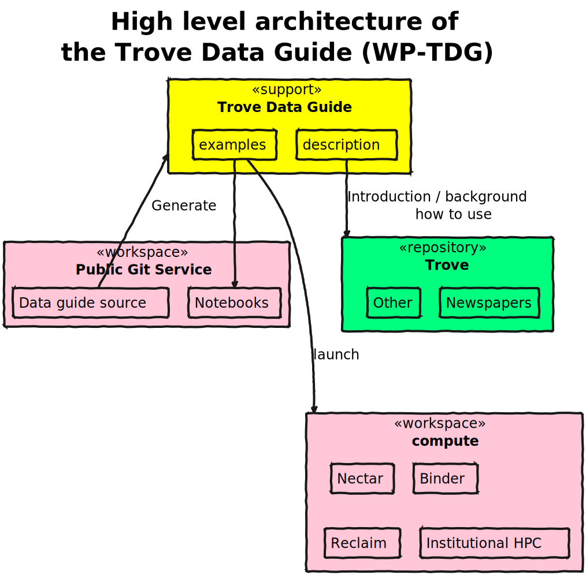
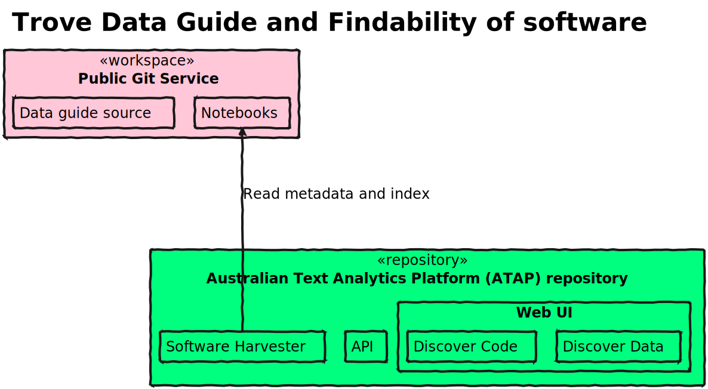
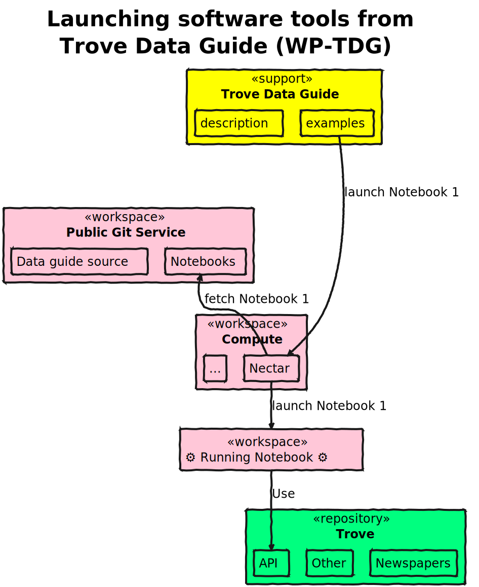

# Image summary for phase1

## [phase1/abstract-fair-architecture.svg](./abstract-fair-architecture.svg)

## [phase1/fairification-of-trove-and-glam-repos.svg](./fairification-of-trove-and-glam-repos.svg)

## [phase1/skills-mapping.svg](./skills-mapping.svg)

## [phase1/standards-components.svg](./standards-components.svg)

## [phase1/trove-conceptual-architecture.svg](./trove-conceptual-architecture.svg)

## [phase1/work-cycle.svg](./work-cycle.svg)

## [phase1/wp-iaw-publication.svg](./wp-iaw-publication.svg)

## [phase1/wp-iaw-sia-initial-deployment-fixed-term.svg](./wp-iaw-sia-initial-deployment-fixed-term.svg)

## [phase1/wp-tdg-architecture.svg](./wp-tdg-architecture.svg)

## [phase1/wp-tdg-findability.svg](./wp-tdg-findability.svg)

## [phase1/wp-tdg-launching-tools.svg](./wp-tdg-launching-tools.svg)

