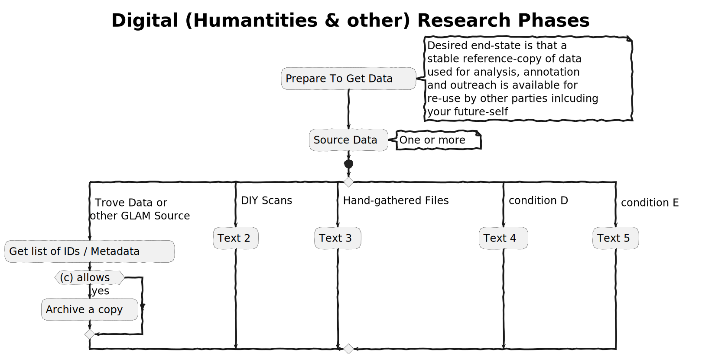

# Image summary for phase2

## [phase2/annotation-workflows.svg](./annotation-workflows.svg)

## [phase2/api-stability.svg](./api-stability.svg)

## [phase2/cdl-as-factory.svg](./cdl-as-factory.svg)

## [phase2/cdl-phase-2-project-pipeline.svg](./cdl-phase-2-project-pipeline.svg)

## [phase2/cdl-research-phases.svg](./cdl-research-phases.svg)

## [phase2/idealised-workflow.svg](./idealised-workflow.svg)

## [phase2/phase-1analyse-retain.svg](./phase-1analyse-retain.svg)

## [phase2/potential-future-architecture.svg](./potential-future-architecture.svg)

## [phase2/redo-desktop-app.svg](./redo-desktop-app.svg)

## [phase2/transforming-proxy-pattern.svg](./transforming-proxy-pattern.svg)

